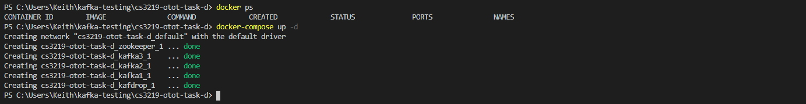
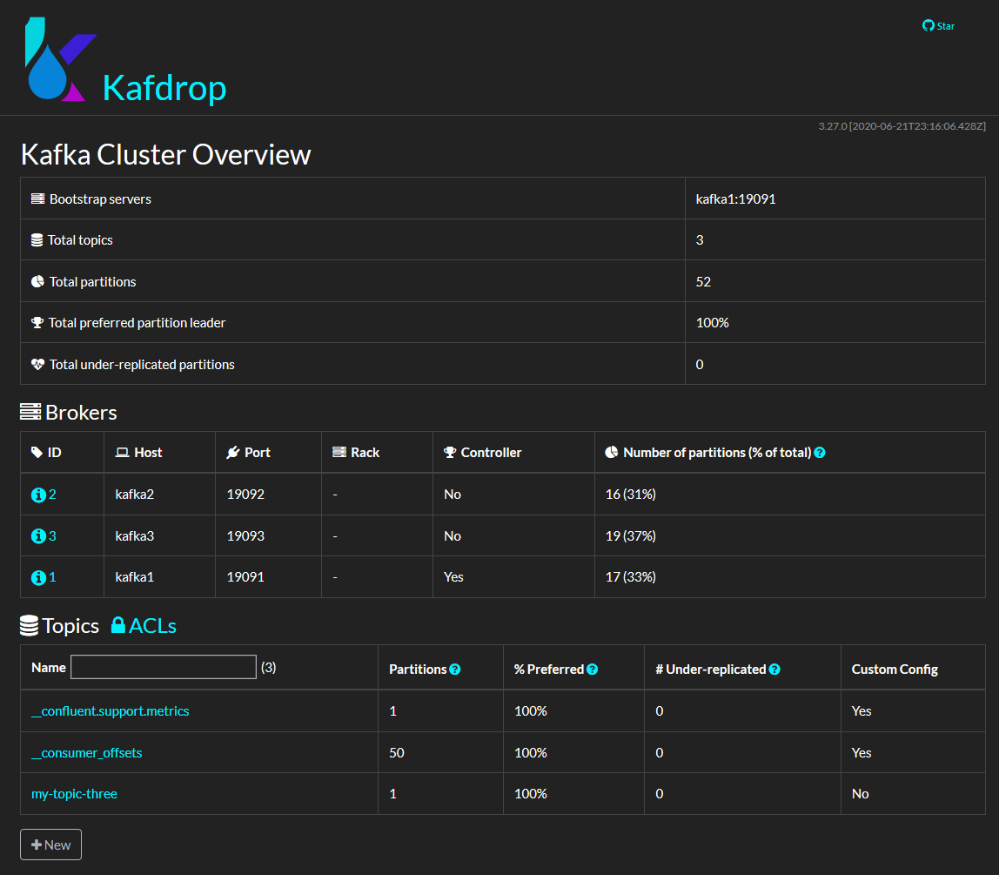
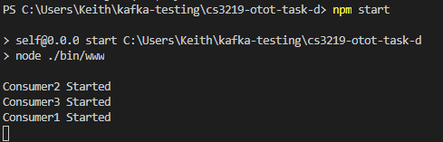
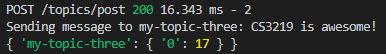
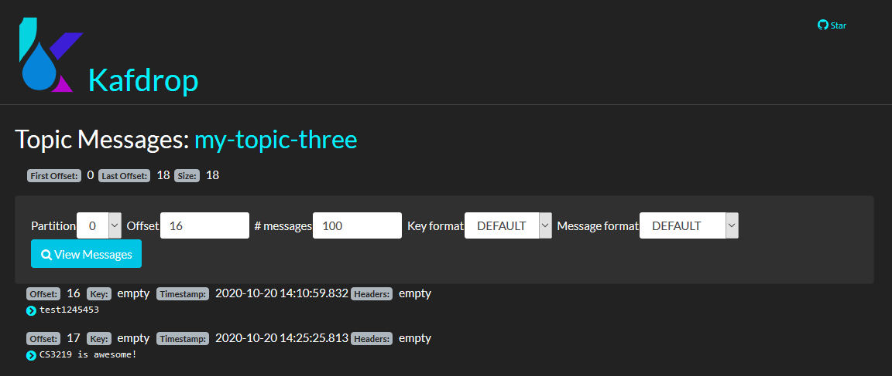
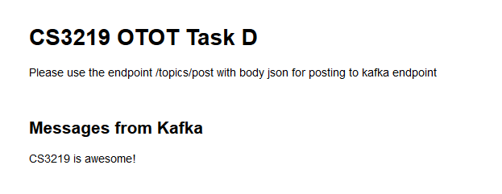
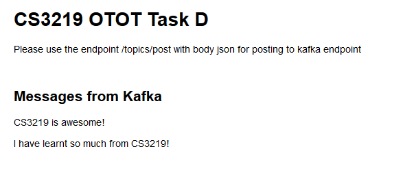
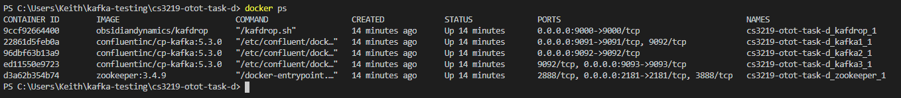
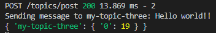
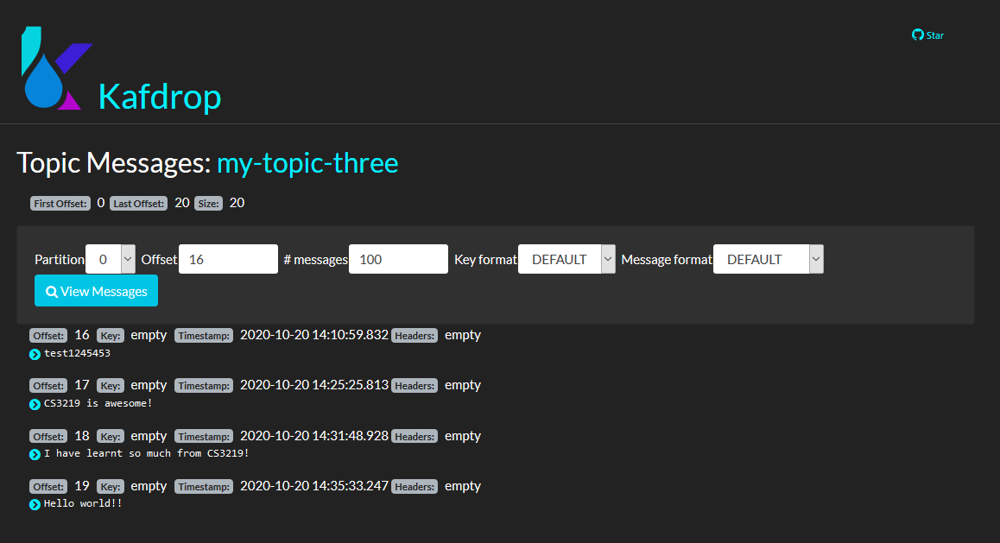

# CS3219 OTOT Task D

Name: Fong Zhi Zhong\
Student Number: A0168560Y

## Requirements
- Node js v12.18.0
- Docker
- Docker Compose

## Installation
1. cd to project directory
2. Run ```docker-compose up -d```
3. Run ```npm install```
4. Run ```npm start```

## Features
Ontop of the 3 different kafka instances and zookeeper being ran, I have added Kafdrop, a Web GUI interface for monitoring messages accordingly and displaying the data published.
Kafdrop is locted at ```localhost:9000``` and is started with the same docker-compose command.

## Testing of Pub-Sub
When ```docker-compose up -d``` is ran, this is what you should see


### KafDrop
As said, Kafdrop, a GUI interface can be used to monitor the kafka instances easily. It looks like this.


From this, we can see that we have 3 brokers running at different ports with the list of topics available easily to us. Next, lets test the publishing of data

### Publishing of data
I have used ```express generator``` to simplify the pushing of data using a POST endpoint. After the express server is started with ```npm start```, it will look something like this.\
\
Express server is now running on port 3000.\
Do note that the order of the consumer being started depends and will vary accordingly.\
In order to publish data to the kafka instances, you can POST to ```http://localhost:3000/topics/post```

Upon publishing of data, you will see the return message of the offset as the last digit, in this case, 17. Inspecting Kafdrop to ensure that the data is publish shows a similiar result.

From here, we can publish from just a simple HTTP request and extend it accordingly to a front end service like React or vue.

### Subscribing of data
Having previously published our data of "CS3219 is awesome!", it can then be immediately reflected at ```localhost:3000```.\

Messages are dynamically appended to the array. This is due to how our consumers located at ```index.js``` is a consumer group to ensure fault tolerance. Upon adding another set of data via our POST endpoint, it will look like this.


## Testing of Fault tolerances of cluster
Before anything, please ensure that your express server is currently running. In order to do this, use 2 different terminals. \
To test fault tolerance, we first check what clusters are currently available and choose one to shutdown. \
In order to know which clusters to shut down, we find them using ```docker ps```

From here, to test, we will stop a random kafka instance, so we run 
```docker stop 22861d5feb0a```

Upon stopping of the instance, in order to ensure both Pub and Sub is working as intended, we POST to check accordingly.\


With our Kafdrop instance showing the latest message appended in, our kafka instance has taken over as the master.
